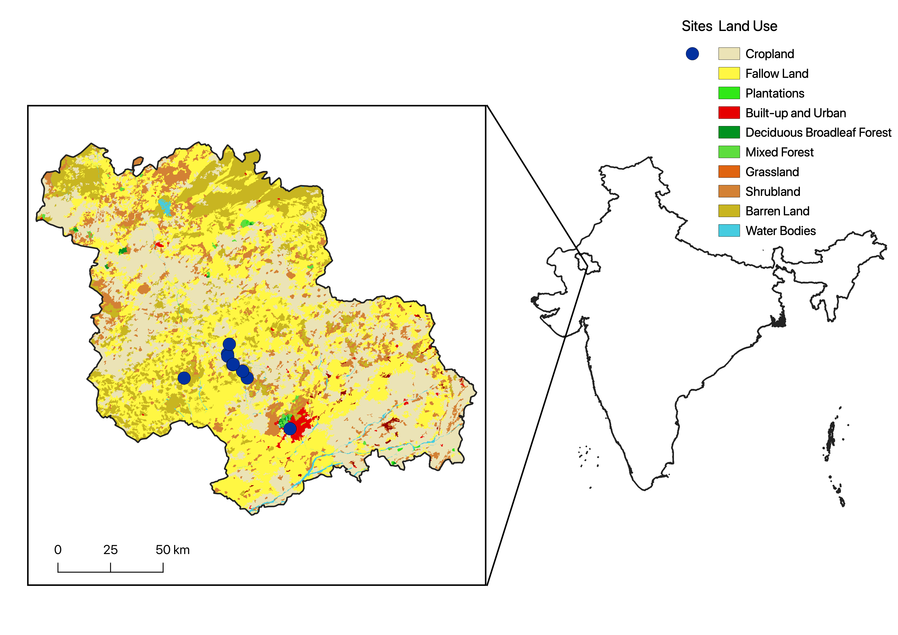

This is the data and analysis utilized in the poster "Exploring water scarcity through
the dynamics of social power: The case of the Thar Desert" by Madison Weisend, mentored by
[Matthew Lundquist](https://www.lundquistecology.com). 

In this repository you will find:

1. Analysis R code
2. Green roof plant dataset
3. Soil and air temperature logger data from September and October 2020
4. Final [poster](poster.pdf).